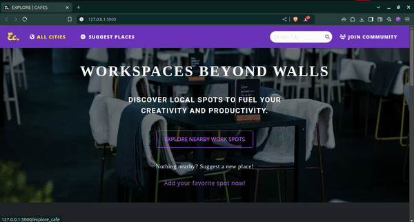

# ExploreCafe-Website 🌟

Welcome to **ExploreCafe**—the app that helps you find the best work-friendly cafes. Whether you’re after strong Wi-Fi or a quiet corner, we’ve got the perfect spot for you. Discover, add, and enjoy the ideal cafe for productivity! ☕

## 🎥 🌐 Live Preview

Check out the live version of the ExploreCafe website [here](https://explorecafe-website.onrender.com/). 

## 🌟 Features

- **Cafe Search**: Find work-friendly cafes based on location.
- **Add New Cafes**: Share details about new cafes, including amenities and images.
- **Amenity Filters**: Identify cafes with facilities like Wi-Fi, power outlets, and seating options.
- **Interactive Interface**: Simple and intuitive UI for seamless navigation.

## 🚀 Getting Started

### Prerequisites

- **Python 3.x** installed on your computer.
- **Flask** and other dependencies listed in `requirements.txt`.

### Installation

1. **Clone the Repository**
   ```bash
   git clone https://github.com/KushalRegmi61/ExploreCafe-Website.git
   cd ExploreCafe-Website
   ```

2. **Install Dependencies**
   ```bash
   pip install -r requirements.txt
   ```

3. **Run the Application**
   ```bash
   python main.py
   ```

4. Open the app in your browser:
   ```text
   http://127.0.0.1:5000
   ```


## 🛠️ Project Structure

```
/ExploreCafe-Website
├── main.py                # Application entry point
├── requirements.txt       # List of Python dependencies
├── templates/             # HTML templates
│   ├── add_cafe.html          # Form for adding cafes
│   ├── base.html              # Base template for extending other pages
│   ├── cafe_details.html      # Page displaying detailed cafe information
│   ├── cafe_list.html         # List of cafes matching search criteria
│   ├── delete.html            # Confirmation page for deleting a cafe
│   ├── explore_cafe.html      # Explore cafe features
│   ├── feedback.html          # Page for submitting user feedback
│   ├── index.html             # Homepage with a search bar
│   └── update_cafe.html       # Form for updating cafe details
├── static/                # CSS and static assets
│   ├── css/                # Stylesheets directory
│   │   └── styles.css       # Main CSS file for the application
│   └── img/                # Directory for images
└── README.md              # Project documentation
```


## ✨ Usage

1. Launch the app and explore cafes listed in your area.
2. Use the search bar to filter cafes by location.
3. Add new cafes by providing details like name, location, amenities, and an image.

 ## 🎥 DEMO
  Here is the overview of the website.
 
 
 

## 🌍 Contributions

Contributions are welcome! If you’d like to enhance this project, fork the repository, make your changes, and submit a pull request.


Enjoy exploring and contributing to work-friendly spaces! 🏡☕
```

Let me know if there’s anything you’d like to add or tweak!
